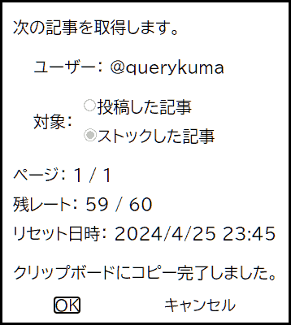

# QiitaApiBookmarklet

QiitaApiBookmarkletは[Qiita API](https://qiita.com/api/v2/docs)で記事一覧を取得するブックマークレットです。

## 機能

- 開いている現在のURLの形式から自動的に判断して、タグの記事一覧か、検索結果の記事一覧か、ユーザーの記事一覧（投稿かストック）を取得できます。
- 取得した記事一覧は通常クリップボードにコピーされ、そのままExcelに添付できます。クリップボードにコピーできなかった場合、ダウンロードします。
- Qiita APIの取得状況（ページ、残レート、リセット日時）をリアルタイムで確認できます。
- 記事一覧の取得中でもキャンセルできます。キャンセルまでに取得した記事一覧を取得できます。

## 使い方

最初に、ブックマークレットを作成します。ウェブブラウザで新しいブックマークを追加して、名前欄に任意の名前を記入し、URL欄に[このリンク](https://raw.githubusercontent.com/querykuma/QiitaApiBookmarklet/main/dist/qiita_api_get_bookmark.js)の内容を貼り付けます。

つぎに、Qiitaのページ（タグか、検索結果か、ユーザー）を開きます。

最後に、ブックマークレットをクリックして記事一覧取得を実行します。

## URLとQiita APIの対応

| タイプ               | URL                          | Qiita API                     |
| -------------------- | ---------------------------- | ----------------------------- |
| タグ                 | qiita.com/tags/:tag_id       | /api/v2/tags/:tag_id/items    |
| 検索結果             | qiita.com/search?q=:query_id | /api/v2/items?query=:query_id |
| ユーザー（投稿）     | qiita.com/:user_id           | /api/v2/users/:user_id/items  |
| ユーザー（ストック） | qiita.com/:user_id           | /api/v2/users/:user_id/stocks |

## ブックマークレットが取得する項目

| title    | 記事タイトル           |
| -------- | ---------------------- |
| url      | URL                    |
| tags     | カンマ区切りのタグ一覧 |
| created  | 作成日時               |
| updated  | 更新日時               |
| comments | コメント数             |
| likes    | いいね数               |
| stocks   | ストック数             |
| id       | URLにもある記事id      |

## その他

[MakeBookmarklet](https://github.com/querykuma/MakeBookmarklet)は、ブックマークレットを出力するためのwebpackのプラグインのリポジトリです。

